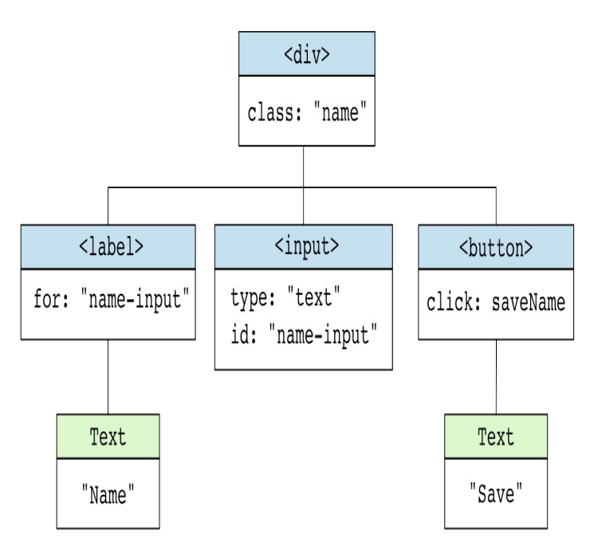
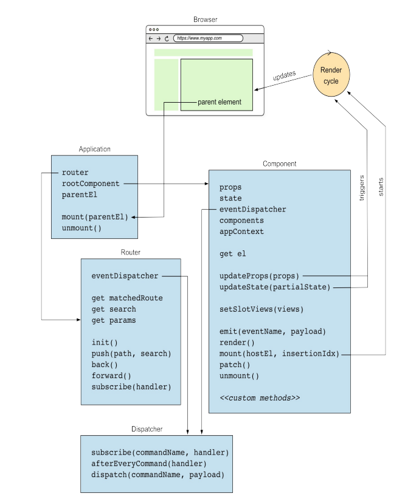
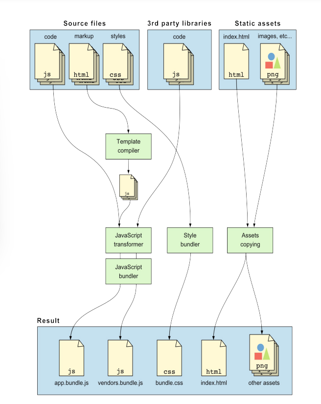
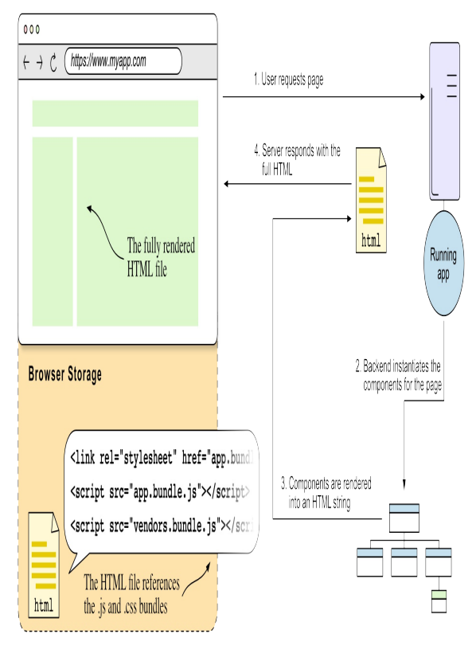
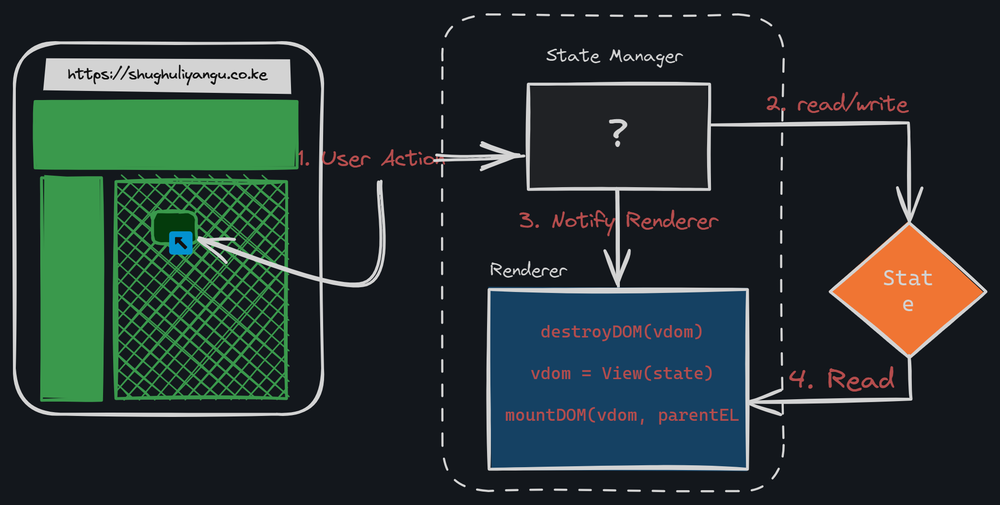

# Syronjs

> This is a hobby framework project exploring the in depths of Javascript got the motivation from the React compiler.

- The inspiration behind this project is the exploration of the how DOM manipulation and business logic can integrate seamlessly.

### Why?

- Working frameworks has always been a mystery to me:
1. How do they work internally? 
1. How do they re-render a component?
1. How do they only update parts of the DOM that change?
1. How does the URL change without a page request to the server?

- These days its uncommon to find applications written in vanilla JavaScript. This is because modern frameworks boost productivity and make it easier to build complex applications.

> It's worth noting frontend frameworks are tools; a means to an end, the end being efficiently building and maintaining (complex) applications.

## Shortcomings?

1. We will only support the [standard HTML namespace](https://www.w3.org/1999/xhtml/) - this means we will expect HTML elements to be defined within the namespace.
1. We will not support [component-scoped CSS](https://www.gatsbyjs.com/docs/how-to/styling/css-modules/). [More on what that is](https://github.com/css-modules/css-modules). Which means our CSS will be global, and class names have to be unique.


## Features
1. [] Virtual DOM Abstraction.
1. [] Reconciliation Algorithm.
1. [] Component-Based Architecture, where each component:
    - [] Has its own state
    - [] Has its own lifecycle methods
    - [] Re-renders itself and its children when its state changes
1. [] A(n) (SPA) Single Page Application Router, that updates the URL without a page request to the server.
1. [] Slots to render content inside a component.
1. [] HTML templates that compile to JavaScript render functions.
1. [] Server Side Rendering (SSR) - Renders the view on the server instead of the browser for faster page loads and better SEO.

#### Framework vs Library

- When you use a library you use its code and call its functions. When you use a framework, you write the code the framework calls.
- The framework is in charge of running the application, and executes your code appropriately.
- I realized I was a framework fanboy but have no idea how they work internally. Like what the hell is a virtual DOM? You mean there's a `reconciliation algorithm` (how browser decides what in the DOM needs updating)?

- The goal of this project si to borrow ideas from Vue , Svelte, React, Preact and Angular just to name a few. It's to build a simple framework that includes some if not most of the features of these frameworks.

- It's worth noting [Svelte does not use the Virtual DOM](https://svelte.dev/blog/virtual-dom-is-pure-overhead), and considers it to be pure overhead.

    https://github.com/Cyrus-0101/syronjs/assets/46367331/461be10f-caf2-4fca-8142-44f1c82b5443

- But we'll use the [virtual DOM because its really fast](https://www.youtube.com/watch?v=x7cQ3mrcKaY). The virtual DOM is a lightweight copy of the actual DOM. When the state of the application changes, the virtual DOM is updated instead of the actual DOM. The virtual DOM is then compared to the actual DOM and only the differences are updated. This is what makes the virtual DOM so fast.

- For instance, consider the following HTML markup:

```html
    <div class="name">
        <label for="name-input">Name</label>
        <input type="text" id="name-input" />
        <button>Save</button> <!-- Its worth noting that saveName() event handler is typically not shown in the HTML markup, but added programmatically -->
    </div>
```

> The `reconciliation algorithm` is the process that decides what changes need to be made to the browser's DOM to bring it in sync with the virtual DOM. The algorithm is responsible for updating the browser's DOM efficiently.

- Below is a vDOM (Virtual DOM) representation of the HTML markup above:

    


#### Hydration
- This is the process by which a framework matches HTML elements with corresponding virtual DOM nodes and attach event handlers to make the HTML interactive on the browser.
- The `hydration algorithm` binds the browser to the virtual DOM, and is responsible for updating the browser's DOM efficiently. SSR requires a server to run, but serving static files is cheaper than rendering pages as users request them.

- It's not React, but its something alright. Below is the architecture of the framework:

    

- We will add a [Webpack](https://webpack.js.org/) loader module to compile HTML templates to JavaScript render functions. This will allow us to write HTML templates and have them compiled to JavaScript render functions. Which means instead of writing this:

```javascript
    function render() {
        return h('div', { class: 'container' }, [
            h('h1', {}, ['Look, Ma!']),
            h('p', {}, ["I'm building a framework!"])
            // h() is a function that creates a virtual DOM node
        ])
    }

```

- We can write this:

```html
    <div class="container">
        <h1>Look, Ma!</h1>
        <p>I'm building a framework!</p>
    </div>
```

## How frontend frameworks work
- Let's briefly learn how frontend frameworks work, from outside.

### Developer Story:
-  A new project is created from the framework's CLI tool or by manually installing the dependencies and configuring the project.

#### SideNote: NodeJS
- A frontend project is a regular NodeJS project. Using NodeJS helps by providing an infrastructure to `run scripts`, `compile`, and `bundle` our code as well as managing dependencies. We could forego the whole process and use a CDN., and manage dependencies manually - an inconvinience.
- `Components` are created and they define a part of the application's view, and how the user interacts with it. Components are written in HTML, CSS and JavaScript code.
- Most frameworks use the Single FIle Component (SFC) format, where the HTML, CSS and JavaScript code are in the same file. This makes it easier to manage the component's code.
- The exception is `Angular`, which uses three separate files for the HTML, CSS and TypeScript code, allowing for better separation of languages and concerns imo.
- `React` & `Preact` use JSX - a syntax extension for JavaScript that looks like HTML - instead of writing HTML code.
- `Svelte`, `Vue` and `Angular`, use HTML templates with `directives` to 'add' or 'modify' the behaviour of the DOM elements such as, iterating over and displaying an array of items, or conditionally rendering an element.
- Check out some Vue and Angular examples below:
```javascript
    // Vue
    <p v-if="salamu">
       Au Sio
    </p> 

    // Angular
    {#if salamu}
        <p>Au Sio</p>
    {/if}

    // React
    {salamu && <p>Au Sio</p>}
```
- The code is thhen bundled into fewer files than originally written, to enable the browser to load the application faster with fewer requests. This is done using a bundler like Webpack or Rollup.
- The files can also be minified to reduce their size, by removing whitespace and comments, and renaming variables to shorter names. This process is called `building`.

- Most of the work of building the application is usually done by the framework itself., which provides a CLI toolto build the app with a simple script like `npm run build`. 
- What is involved in building:
1. The template for each component is transformed - by the template compiler - into JS code, that, executed in the browser, creates the component's view.
1. The components' code - split in multiple files - is transformed into a single JS file `app.bundle.js`. However for larger applications ot's no tincommon to have multiple bundles and lazily load them.
1. The 3rd party code used by the application is bundled into a separate file `vendor.bundle.js`. This file includes the code for the framework itself, along with 3rd party libs. This file is cached by the browser and is not re-downloaded when the application is updated.
1. The CSS code is in the components is extracted and bundled into a single file `bundle.css`. This file is loaded by the browser and used to style the application (Can be multiple files).
1. The HTML file that will be served to the user `index.html` is generated or copied from the static assets directory.
1. The static assets, such as images, fonts, and other files, are copied to the output directory, can optionally be preprocessed, minified, or optimized to a different format.

- From the above we can see a typical build process yields 4 files (or more for larger apps):
1. `index.html` - The entry point of the application.
1. `app.bundle.js` - The application's code.
1. `vendor.bundle.js` - The framework's code and 3rd party libraries.
1. `bundle.css` - The application's styles.

- It's worth noting, when a file is `statically` served, the server doesn't need to do anything before sending it to the user, the server simply reads the file from disk and sends it to the user's browser.
- Below is a simple illustration of the build process:

    

### Browser Story:
- In an SPA, the server responds with a - mostly empty - HTML file that's used to load application's JavaScript and CSS files. The framework will then create and update the application's view using the [`Document API`](https://developer.mozilla.org/en-US/docs/Web/API/Document) and the [`CSS Object Model (CSSOM) API`](https://developer.mozilla.org/en-US/docs/Web/API/CSS_Object_Model).
- A router makes sure not to reload the entire application when the user navigates to a different URL, but rather updates the view to show the new content.
- `Mounting` - The process of attaching the application to the DOM - is done by the framework, which creates the root component and attaches it to the DOM.

- The framework is in charge of updating only the parts of the HTML that need to be updated in a process called `patching` the DOM. A single change to the DOM is called a `patch`.

- Making changes to the DOM is always `expensive`, it's the framework's role to minimize the number of changes made to the document. [Here is a blog post that explains why DOM manipulation is expensive](https://web.dev/learn/performance/understanding-the-critical-path). How any of this is achieved varies across frameworks, some use a vDOM.

#### How frameworks update the view
- As of 24/05/2024:
- Svelte understands the ways the view can be updated at compilation time, and produces JS code to update the exact parts of the view that need to be patched for each possible state change. It is remarkably performant since it does the least amount of work in the browser to update the view.

- Angular runs a `change detection routine` - comparing the last state it used to render the view with the current state - everytime it detects the state might have changed.

- Changes to the state of a Component typically happen when an event listener runs, when data is requested to a server via a HTTP requesr or when `MacroTasks` (such as setTimeout() or setInterval()) or `MicroTasks` (such as  Promise.then()) are executed.

- Angular makes this possible by using `Zone.js` - a library that monkey patches the browser's APIs to detect when a task is run, and then runs the change detection routine - an execution context that's aware of the asynchronous tasks running at any given time.

- [JavaScript Event Loop](https://javascript.info/event-loop), is a good resource to understand how the JS event loop works and the difference between micro and macro tasks.

- Most frameworks use a vDOM representation of the view, by comparing the last known vDOM with the DOM after a state change, they compute the minimum changes required to update the HTML.

- React does this vDOM comparison every time the state is changed by the component using either `setState()` or `useState()` hook's mechanism.
- Vue uses a remarkable approach imo and includes a reactivity layer the developer can use to define the application's state. These reactivity primitives wrap regular JS objects (arrays or sets), and primitives (strings, numbers, booleans) and when the state changes, notify the components that depend on it to re-render.

#### Routes
- An SPA works with a single HTML file where the markup code is updated programmatically by the framework, so new HTML pages are not requested from the server, when a user navigates to a different route.
- The illusion of multiple pages is created by the framework, which renders the components configured for each route.

#### Server Side Rendering (SSR) & Hydration
- A server-side rendered application is a web application that renders the HTML markup on the server and sends it to the browser. This means there needs to be a backend that handles requests and renders HTML pages.
- In the browser, the frontend code is responsible for handling user interactions and updating the view to reflect the changes when a user navigates to a different route. However, when a user navigates to a different route, the browser requests a new HTML page from the server instead of programmatically updating HTML markup.
- Here is an illustration of what that looks like:

    

- The server generates the page each time its requested. The HTML file served to the user displays already rendered HTML markup, negating the need of using the Document API to generate it programmatically.
- Its worth noting the HTML from the server lacks interactivity (event listeners).

    

- The HTML instructs the browser to load the application JS and CSS files, once JS code is parsed, the framework code connects the existing HTML (produced in the server), to the component's vDOM and attach event handlers. Afterwards can the user interact with the page.
- When a user interacts with the page, the frameworks event handlers are triggered and the framework patches parts of the HTML that need to be updated. All this happens in the browser.

## Virtual DOM

- In [PR #1](https://github.com/Cyrus-0101/syronjs/pull/1), [examples/vanilla/todo](./examples/vanilla/todo/todo.js), we can see how mixing application logic and DOM manipulation can be a pain. The code is hard to read and maintain, and it's easy to introduce bugs.

> Just like a virtual machine, the vDOM `mimics` the actual DOM. The DOM is an in-memory tree of JS objects representing the HTML page.

- The nodes in the actual DOM are heavy objects that have hundreds of properties , whereas the virtual nodes are lightweight objects that have only the properties needed to render the view. Virtual Nodes are easy to create and manipulate.

-  If for every event resulting from the user interacting with the application, we have to implement not only the business logic—the one that gives value to the application—but also the code to update the DOM, the codebase becomes a hard-to-maintain mess, anightmare if you may.
- From the todo instance we can see DOM manipulation code is `very imperative` code, which describes how to do something step by step. It's also a low level operation that requires a concrete understandting of the Document API, and sits below the application logic.
- Picture an architect, his/her work only revolves in designing the house, imagine if he had to build the house, manage the builders every single step of the way. Probably the most inefficient way to build a house.
- For the sake of productivity the architect only focuses on `what` needs to be build and let's the construction company take care of the `how`.

- In this [PR #2](https://github.com/Cyrus-0101/syronjs/pull/2), we want to accomplish (Separation of concerns):
1. Separation of `Application Code` - code that describes the view, from the `Framework Code` - code that uses the Document API to manipulate the DOM and create the view.
- Here is what our starting structure will look like
```sh
    runtime
        └── src
            ├── utils
            │   └── arrays.ts
            ├── h.ts
            └── index.ts
```
- We need to represent 3 types of nodes in the vDOM:
1. `Element Nodes` - Represents a HTML element that has a tag name such as `div`, `p` etc.
1. `Text Nodes` - Represents a text node that has a text value.
1. `Fragment Node` - Represent a collection of nodes that don't have a parent node until attached to the DOM.

- In our `h` file we define our constants and types.

### Element Nodes
- Represent HTML elements defined to structure your web pages, eg `<h1>`, `<p>` etc. We'll create a function `h()` short for hyperscript or [syronjs.createElement()](### "similar to React.createElement()"), that creates an element node.

- Given some child nodes might come as null, we'll filter them out, before transforming them to Virtual nodes. They should not be rendered, and should be removed from the array of children.

### Fragment Nodes
- A fragment node is a collection of multiple nodes that need to be attached to the DOM together, but have no parent node. They are simply a container for an array of virtual nodes. They exist in the Document API, represented by the `DocumentFragment` object and can be created using the `document.createDocumentFragment()` method.

- `hFragment()` will create fragment virtual nodes. Its function signature will be similar to `h()` but will return a fragment node, we filter null values from the array and then map strings in the children array to text virtual nodes.

### Components
- Components in syronjs will be a mini-app of its own; have its own internal state & lifecycle, in charge of rendering a part of the view. It communicates with the rest of the  application by emitting events and receive props (data passed to the component from outside), re-rendering its view when a new set of props is passed to it.

### Mounting and Unmounting the vDOM
- `h()`, `hString()` and `hFragment()` functions create virtual nodes of type `element`, `text` and `fragment` respectively. The virtual nodes are then attached to the DOM using the `mountDOM()` function. When mountDOM() function creates each of the DOM nodes for the virtual DOM it saves a reference to the real DOM node in the vDOM under the `el` (element) property. This is what our `reconciliation algorithm` will use to know what DOM nodes need update.

    

- If the node included `event` listeners, the `mountDOM()` function saves a reference to the event listeners in virtual node, under the `listeners` property. This is what our `reconciliation algorithm` will use to know what event listeners need to be removed.

    

## State Manager
- The state manager is in charge of keeping the application's state in sync with the view, responding to user input by modifying the state accordingly, and notifying the `renderer` when the state has changed.
- The `renderer` is the entity that takes the virtual DOM and mounts its to the DOM. In [PR #5](https://github.com/Cyrus-0101/syronjs/pull/5), we will work implemmenting the `renderer` and `state manager`. FYI it just looks like a state manager and renderer glued together will work on separating files as we explore.
- We'll build a small rudimentary state manager that completely destroys and mounts the DOM everytime the state changes.

    

- From the illustration we:
1. Destory the current DOM (destroyDOM())
1. Create the virtual DOM representing the view given the current state (View())
1. Mount the virtual DOM to the DOM (mountDOM())

- This is by no means optimal, but it works for now.

### Events vs Commands
- `Events` are notifications about something that has happened: 'button clicked', 'key pressed', 'network request completed' etc. The names are usually in past tense like 'button-clicked', 'key-pressed', 'network-request-completed'.
- A `command` is a request to do somethingina a particular context. 'Add todo', 'Edit todo', 'Delete todo' etc. The names are usually in imperative tense like 'add-todo', 'edit-todo', 'delete-todo'.

- The `dispatch()` function creates a link between the browser events and the commands dispatched by the app dev to the framework.

### Reducer Functions(Redux)
- A reducer function is a function that takes the current state and a payload (action/command data), and returns a new state. The reducer function is the only place where the state can be modified. The reducer function is a pure function, meaning it does not mutate the state passed to them and return a new state.

### Dispatcher Functions
- Association between `commands` and `reducer` functions is done by the `dispatcher()`. It is responsible for dispatching the commands to the functions that handle the command. To do this the dev will tell it which handler function(s) to execute in response to each command.

- The command handler functions are `consumers`. Consumer technically means a function that accepts a single parameter, and returns no value.

